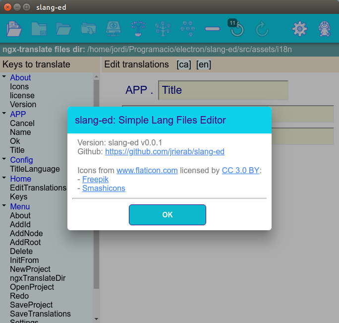

# slang-ed

[Català](#català)
[English](#english)



## English
slang-ed: Simple Lang Files Editor - An Electron/Ionic application to edit i18n language translations files.

It is intended to ease the translation of your content to different languages when using the [ngx-translate](http://www.ngx-translate.com/) internationalization (i18n) library for Angular. Allows the edition of JSON translation files.

### Usage
1. "*Init from...*" an already prepared Angular/Ionic directory.
* Search in a typical "*src/assets/i18n*" directory structure.
* Language files should be JSON files which follow the 2-char language abbreviation [2-char language abbreviation](https://en.wikipedia.org/wiki/List_of_ISO_639-1_codes) (like 'en.json').
2. Edit language keys as you like...
3. "*Save Translations*" to update the i18n language files.

### Install
1. Install NVM (*Node Version Manager*) from [https://github.com/creationix/nvm](https://github.com/creationix/nvm)
2. Install [Node](https://nodejs.org)
```
nvm install latest
```
3. Install [Ionic](https://ionicframework.com/)
```
npm install -g cordova ionic
```
4. Clone this repository
```
git clone https://github.com/jrierab/slang-ed.git
```
5. Install dependencies
```
cd slang-ed
npm install
```

### Build
1. Test electron desktop application
```
npm run foreman-start
```
2. Build linux desktop application with electron
```
npm run build
npm run dist
```
### To Do
* Manage project files: create, open, save (this will allow to store "extra" info in language definitions.
* Support for properties in language definitions: *comment* (for translators), *approved* (verified), foundInSrc (present in source code), preserve (do not remove, even if not found in source code).
* Add/remove languages in current project.
* Save i18n files in *object* format (instead of *full key string* format).
* Multi-word edition (all the descendants of a certain node).
* Signal pending translations, approvals, comments...
* Others: suggestions are welcome.

### Credits
* This application is developed using the [Ionic framework](https://ionicframework.com/framework) which is licensed by [MIT license](https://github.com/ionic-team/ionic/blob/master/LICENSE).
* Desktop application generated by [electron](https://electronjs.org/) which is licensed by [MIT license](https://github.com/electron/electron/blob/master/LICENSE).
* Icons made by [Smashicons](https://www.flaticon.com/authors/smashicons) and [Freepik](https://www.flaticon.com/authors/freepik) from [Flaticon](https://www.flaticon.com/) are licensed by [Creative Commons BY 3.0](http://creativecommons.org/licenses/by/3.0/).
* Read.md file edited by [Remarkable](https://remarkableapp.github.io/linux.html).

## Català
slang-ed Simple Lang Files Editor - Una aplicació Electron/Ionic per a editar fitxers i18n de traduccions d'idioma.

Està pensat per facilitat la traducció del vostre contingut a diferents idiomes quan s'utilitza [ngx-translate](http://www.ngx-translate.com/) com a llibreria d'internacionalització (i18n) per Angular. Permet l'edició dels fitxers JSON de les traduccions.

[Ús](#usage)
[Instal·lació](#install)
[Execució](#build)
[Pendent](#todo)
[Crèdits](#credits)
